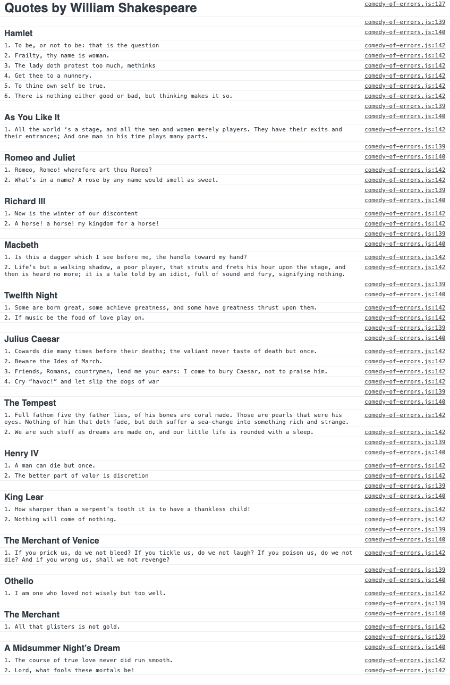

# Comedy of Errors

## Objective
Using the debugging tips and tools you have learned to find and fix all the errors in the files provided. 

## Functionality 
When the script is fully functional, it should output a list of Quotes by William Shakespeare sort by their respective works. Quotes within each work should be numbered starting with `1`. 

The following screenshot is an example what the final output should look like.

## Tips

1. Use the browser console to check for syntax errors. 
2. The console will display the error message, filename and line number of the error. 
3. Sometimes the mistake is made on a line before the error occurs.
4. The console may only display one or two errors at a time.  
5. Use the code tracing technique to find logic errors.
6. Use `console.log()` to follow the path the program takes to help find the error. 
7. Walk through the program with a friend, line by line, to see if something is out of place. 

